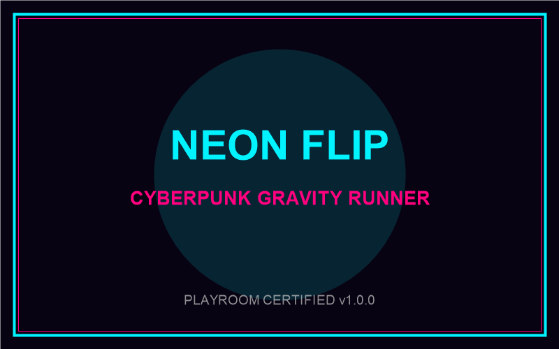

# 霓虹反轉 (Neon Flip)



《霓虹反轉》(Neon Flip) 是一款極速賽博龐克重力反轉跑酷街機遊戲。單鍵掌控重力方向，在天花板與地板兩極霓虹導軌間穿梭、極限避障、觸發擦彈狂飆最高分！

---

## 遊戲特色
- **單鍵極簡操控 (One-Button)**：空白鍵、滑鼠點擊或全螢幕觸控，隨時隨地輕鬆暢玩。
- **重力反轉運動學**：乾脆俐落的瞬發重力切換，結合土狼時間（Coyote Time）與輸入緩衝。
- **無解死局預防**：狀態關聯模組化區塊拼接（Chunk System），保證 100% 可通關。
- **雙層 Bloom 渲染**：純 HTML5 Canvas 2D 霓虹發光管線，極致流暢 60FPS。
- **純代碼 Web Audio 聲學引擎**：零外部音訊檔案，內建 16 步進合成波 BGM 音序器與程式化音效。
- **跨平台自適應**：完整支援桌面寬螢幕與手機直向/橫向自適應視口。

---

## 開發與建置

```bash
# 安裝依賴
npm install

# 本地開發預覽
npm run dev

# 生產環境建置
npm run build
```

---

## 授權與發布
本專案嚴格遵循 Playroom 平台接入標準。
- 作者：TommyLam
- 遊戲 ID：`neon-flip`
- 版本：`1.1.0`
